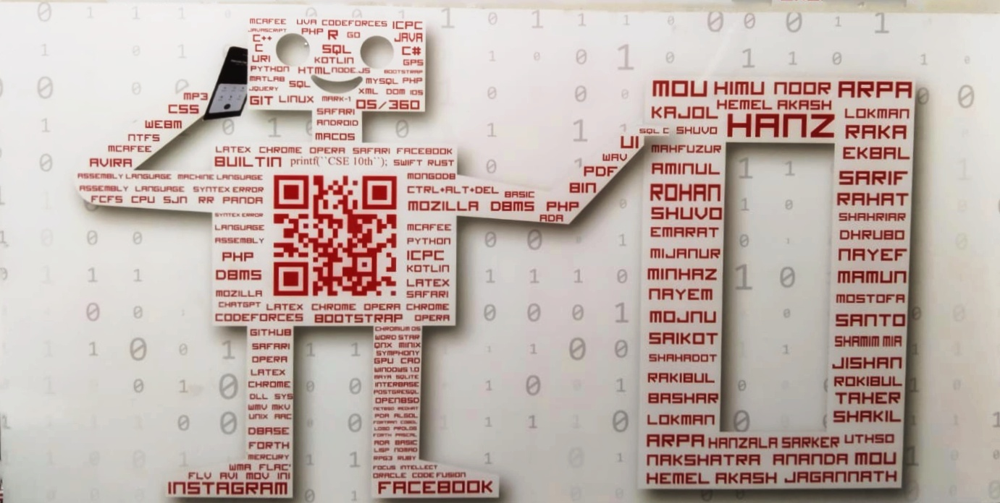

Hello, I am LEO, the virtual representative of the CSE-10th batch, PUST. Our university life started on March 3, 2018, by entering the CSE department, and today it's time to sign out, and it's January 30, 2024. During this long journey, spending time in the classroom, corridor, hall, and every place on this campus brought countless and wonderful memories. Today, at the time of ending, those are glowing in our subconscious minds. We love its memory, we love its air, and we love every bit of this campus. We will miss this campus and the people with those memories.

To the juniors, there are some words for you: The university is an open place to gather knowledge. Learn computer science joyfully, gain practical knowledge, and create thousands of good memories. That knowledge and memory will make life miscellaneous and colorful. Enjoy your time with the people around you. Respect your seniors and treat your juniors with affection and love. Life is beautiful.

Here is the student list of CSE 10th batch:

180101 MARUFA KHATUN MOU
www.facebook.com/marufa.mou0

180102 MD. HASIBHUL ISLAM
www.facebook.com/himukhan11

180104 MD.ABDULLAH IBN NOOR
www.facebook.com/ab.a.noor

180105 MD.LOKMAN HOSSEN
www.facebook.com/profile.php?id=100081928952131

180107 SK SHARIAR AHMED RAKA
www.facebook.com/shahriarraka12

180108 JAGANNATH CHANDRA DAS
www.facebook.com/profile.php?id=100008633796312

180109 MD.SHAHADOT HOSSAIN
www.facebook.com/profile.php?

180110 MD.AMINUL ISLAM
www.facebook.com/profile.php?id=100009828964822

180112 MEHEDY HASAN SAIKOT
www.facebook.com/profile.php?id=100007996418761

180113 MD.MOJNU MIA
www.facebook.com/FullStackMojnu

180114 SHUVO KUMER RAY
www.facebook.com/shuvokumer.ray

180115 ABDULLAH AL ROHAN
facebook.com/linkin.r

180116 EKBAL HASAN

180117 SARIF ISLAM
www.facebook.com/sarif.islam.7982

180118 MD.RAKIBUL ISLAM
www.facebook.com/rakibul.180118

180119 AHSAN AL BASHAR
www.facebook.com/ahsan.thee.62

180120 KAJOL ROY

180122 NAYEM MEHEDI
www.facebook.com/Nayem3073

180123 MD.MINHAZUL ISLAM MINHAZ
www.facebook.com/IamIkaras

180125 MD.SAMIUL ALIM

180126 ARPA KR PUZA
www.facebook.com/profile.php?id=100007636754712

180127 MD.MIJANUR RAHMAN
www.facebook.com/profile.php?

180128 MD.SHAMIM MIAH
www.facebook.com/khan.hridoy.73700

180129 MD.MAHABUL ALOM SANTO
www.facebook.com/mahabulalom.santo

180130 ABDULLAH AL MAMUN
facebook.com/abdullah.almamun.77 

180132 Shamim Reza
www.facebook.com/profile.php?

180133 MD.EMARAT JAHAN
www.facebook.com/himel.jahan.3

180134 MD.MAHFUZUR RAHMAN
www.facebook.com/mahfuz0225

180135 MD.ANANDA MIA
www.facebook.com/ananda.cse35

180136 MD.HANZALA SARKER
www.facebook.com/hanzala.sarkar

180137 NAKSHATRA ROY
www.facebook.com/nakshatra.roy.10420

180138 ARIF HASANAT
www.facebook.com/obakto.valobasha.7

180139 ABU TAHER
www.facebook.com/profile.php?id=100059096294021

180140 ROKIBUL HASAN
www.facebook.com/profile.php?id=100007519937800

180141 HASAN UL KABIR UTHSO
www.facebook.com/hasanulkabir.utsho

180142 HASIBUL HASAN DHRUBO
www.facebook.com/dhrubo.nil.180

180143 MD.A.H.M NOUROZ
www.facebook.com/prince.jishan.9

170111 NAYEF AL MAHBUB SHUVO
www.facebook.com/shahriar.shuvo.589

170116 HEMEL SARKER AKASH
www.facebook.com/hemel.akash.7

170137 Arif Sahriar
www.facebook.com/arif.shahriar.50
